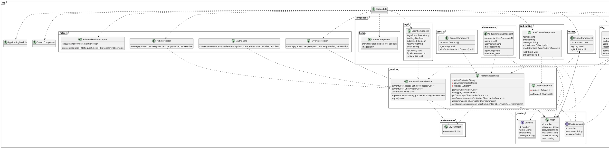

```plantuml
@startuml
package app <<Frame>> {
  package _helpers <<Frame>> {
    class AuthGuard {
      canActivate(route: ActivatedRouteSnapshot, state: RouterStateSnapshot): Boolean
    }
    class ErrorInterceptor {
      intercept(request: HttpRequest, next: HttpHandler): Observable
    }
    class FakeBackendInterceptor {
      intercept(request: HttpRequest, next: HttpHandler): Observable
      fakeBackendProvider: InjectionToken
    }
    class JwtInterceptor {
      intercept(request: HttpRequest, next: HttpHandler): Observable
    }
  }
  package _models <<Frame>> {
    class User {
      id: number
      username: String
      password: String
      firstName: String
      lastName: String
      token: string
    }
    interface Contacts {
      id: number
      name: String
      email: String
      message: String
    }
    interface UserComments {
      id: number
      username: String
      message: String
    }
  }
  package _services <<Frame>> {
    class AuthentificationService {
      currentUserSubject: BehaviorSubject<User>
      currentUser: Observable<User>
      currentUserValue: User
      login(username: String, password: String): Observable
      logout(): void
    }
    class PostServiceService {
      -apiUrlContacts: String
      -apiUrlComments: String
      -subject: Subject<>
      getAll(): Observable<User>
      onToggle(): Observable<>
      getContacts(): Observable<Contacts>
      saveContact(contact: Contacts): Observable<Contacts>
      getComments(): Observable<UserComments>
      saveComments(comment: UserComments): Observable<UserComments>

    }
    class UiServiceService {
      -subject : Subject<>
      onToggle(): Observable
    }
  }
  package components <<Frame>> {
    package aboutme <<Frame>> {
      class AboutMeComponent {
        ngOnInit(): void
      }
    }
    package add-comment <<Frame>> {
      class AddCommentComponent {
        comments: UserComments[]
        users: User[]
        username: String
        message: String
        ngOnInit(): void
        onSubmit(); void
      }
    }
    package add-contact <<Frame>> {
      class AddContactComponent {
        name: String
        email: String
        message: String
        subscription: Subscription
        onAddContact: EvenEmitter<Contacts>
        ngOnInit(): void
        onSubmit(): void
      }
    }
    package blog <<Frame>> {
      class BlogComponent {
        comments: UserComments[]
        loading: Boolean
        users: User[]
        subscription: Subscription
        ngOnInit(): void
        addComment(comment: UserComments): void
      }
    }
    package contact <<Frame>> {
      class ContactComponent {
        contacts: Contacts[]
        ngOnInit(): void
        addContact(contact: Contacts): void
      }
    }
    package header <<Frame>> {
      class HeaderComponent {
        currentUser: User
        logout(): void
        ngOnInit(): void
      }
    }
    package home <<Frame>> {
      class HomeComponent {
        showNavigationIndicators: Boolean
        images: any
      }
    }
    package login <<Frame>> {
      class LoginComponent {
        loginForm: FormGroup
        loading: Boolean
        submitted: Boolean
        returnUrl: String
        error: String
        ngOnInit(): void
        f(): AbstractControl
        onSubmit(): void
      }
    }

  }
  class AppRoutingModule
  class AppModule
package environments {
  class Environment {
    environment: const
  }
}
AppModule ..> ErrorInterceptor
AppModule ..> FakeBackendInterceptor
AppModule ..> JwtInterceptor
AppModule ..> AboutMeComponent
AppModule ..> AddContactComponent
AppModule ..> BlogComponent
AppModule ..> ConactComponent
AppModule ..> HeaderComponent
AppModule ..> HomeComponent
AppModule ..> LoginComponent
AppModule ..> AppRoutingModule
AuthGuard ..> AuthentificationService
ErrorInterceptor ..> AuthentificationService
JwtInterceptor ..> AuthentificationService
HeaderComponent ..> AuthentificationService
LoginComponent ..> AuthentificationService
AddCommentComponent ..> UserComments
AddCommentComponent ..> User
AddCommentComponent ..> PostServiceService
AddContactComponent ..> Contacts
AddContactComponent ..> UiServiceService
BlogComponent ..> User
BlogComponent ..> UserComments
BlogComponent ..> PostServiceService
ContactComponent ..> PostServiceService
AuthentificationService ..> User
AuthentificationService ..> Environment
PostServiceService ..> User
PostServiceService ..> Contacts
PostServiceService ..> UserComments
PostServiceService ..> Environment
User <--* HeaderComponent
}
@enduml
```
